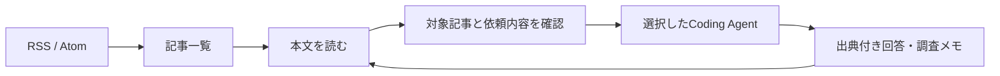

# Reeder × Coding Agents 調査

調査日: 2026-09-11 JST

目的: Reederの閲覧体験を土台に、Orcaのように複数のCoding Agentを接続できるRSSアプリの機能を具体化する。本書は実装前の調査記録。実装・接続試験の現状はREADME.mdとVALIDATION.mdを参照。

## 結論

「記事を読む → 選んだ記事をエージェントと理解する → 調査結果や実装タスクを残す」を同じアプリで完結させる。Reederの3ペインを基本に、本文の隣に必要なときだけAIパネルを開く。

Orcaから取り入れるべき点は、エージェント選択、セッション継続、実行状態、承認待ち、結果の履歴。すべてのRSS記事にgit worktreeやターミナルを用意する必要はない。

## 調査方法と確度

- Reeder 5（bundle ID: com.reederapp.5.macOS）をComputer Useで操作。画面・アクセシビリティ情報・メニューを確認。
- Orcaはonorca.devとstablyai/orcaの公式資料をTinyFishで取得し、公式ドキュメントのChat UIページをComputer Useでも確認。
- アプリ一覧取得がタイムアウトしたため、Orcaデスクトップ実機の接続設定や動作は未検証。インストールの有無も断定しない。
- 以下では「実操作」「画面に存在」「公式資料」「提案」を区別する。対応バージョンやOSの細部は変化が速く、TinyFish取得とブラウザ表示で一部差があったため固定の対応表にはしない。

## Reederで確認したこと

| 領域 | 確認内容 | 確度 | AI版への示唆 |
| --- | --- | --- | --- |
| 画面構造 | 左にフォルダ・購読、中央に記事一覧、右に本文 | 実画面 | 読む流れを維持する |
| RSSアカウント | 現在のアカウントはInoreader。同期時刻と未読件数を表示 | 実画面 | RSS取得元と表示アプリを分離する |
| 整理 | 折りたたみフォルダ、購読元アイコン、階層ごとの未読件数 | 実画面 | AI処理の対象を記事・フォルダで指定できる |
| 記事一覧 | タイトル、抜粋、日付・時刻、購読元、サムネイル | 実画面 | AI要約を付けても一覧の情報密度を保つ |
| 既読管理 | 記事選択で全体とフォルダの未読件数が1減る。Mark as Unreadで復元 | 実操作 | AIが処理した状態と人間が読んだ状態を別々に保存 |
| フィルタ | Starred / Unread / Allの3ボタン | 画面に存在 | 将来のAI結果にも未確認フィルタを用意できる |
| 本文 | 整形されたテキスト、画像、見出し、リンク、表 | 実操作 | AIにはURLだけでなく取得済み本文も渡す |
| Reader View | 通常表示から本文再抽出表示へ切替。表示内容の変化を確認 | 実操作 | RSS本文と再抽出本文の由来を記録する |
| Bionic Reading | 本文ツールバー・Itemメニュー・設定ページに存在 | 画面に存在 | 初期版の優先度は低い |
| 記事操作 | 前後移動、Star、Mark as Unread、Mark All as Read、ブラウザ表示 | メニュー確認 | 頻出操作をキーボードから使える構造にする |
| 購読追加 | Add SubscriptionからSubscribe入力欄とSearchボタンを表示 | ダイアログまで実操作 | URL入力・フィード候補確認の導線を用意する |
| 外部アクション | Copy Link、Instapaper、Open in Chrome、Share | ボタン確認 | 同じ位置に「AIに依頼」を配置できる |
| アクション設定 | Copy Link、Instapaper、Reading List、AirDrop、Mailにツールバー表示とショートカット設定 | 設定画面確認 | よく使うAIアクションを設定可能にする |
| 閲覧設定 | Reader ViewはReadability。フォント、サイズ、色、コントラスト設定 | 設定画面確認 | 長文を読む体験を独立して磨く |
| 一般設定 | ブラウザ選択、バックグラウンドでリンクを開く、未読の並び順、Feed単位のグループ化 | 設定画面確認 | AI処理中も読む操作を妨げない |

Tagsは今回のItemメニューで無効だった。タグ機能が全体として存在しないとは判断できない。OPML移行、検索結果の挙動、オフライン動作、フィード追加の完了、外部共有の送信は未検証。

閲覧で既読になった記事は未読へ復元し、未読件数493・対象フォルダ43への復帰を確認。Reader Viewも通常表示へ戻した。購読追加・設定変更・外部共有の送信は行っていない。

## Orcaの接続モデル

### 起動の互換性と深い統合は別

公式の[Supported agents](https://www.onorca.dev/docs/agents/supported)は、エージェント選択UIがターミナル内でCLIプロセスを起動する方式だと説明する。Claude Code、Codex、OpenCode、Gemini、Cursor CLIなどが対象で、CLIごとにセットアップ、状態検知、利用量表示などの対応度が異なる。

[公式トップページ](https://www.onorca.dev/)は、既存のエージェント契約を持ち込む利用形態を案内している。これを新アプリのAPI利用権や全プロバイダー共通の認証方式と解釈してはいけない。実装時には各CLIの公式な認証・実行インターフェースを確認する。

### ネイティブチャットは追加の統合

[Chat UI](https://www.onorca.dev/docs/agents/native-chat)では、通常のチャット表示は対応エージェントのターミナルセッション上に重ねる実験的な機能。CLIの起動対応だけで、すべてのエージェントの出力が構造化チャットになるわけではない。別経路の構造化チャットも説明されている。

資料で確認できたUI要素は、ストリーミング、送信・停止、モデル選択、ファイル添付、ツール実行の進捗、質問・権限カード、セッション復帰。実際の接続動作は未検証。

### 実行を一覧で追跡する

[Agents & sessions](https://www.onorca.dev/docs/model/agents-sessions)は、実行中・入力待ち・完了・失敗・待機を表示し、エージェントのフックやターミナルのタイトル通知から状態を検知する仕組みを説明している。RSS版では記事や調査タスクにこの状態を紐づけるとよい。

## 初期版の提案

以下は初回調査時の案。後続のユーザー指示で、RSS/Atom直接登録、Claude Code/Codexの2種類、単一記事の要約と追加質問をMVPとして実装する方針に確定した。Inoreader同期は費用を理由に対象外。複数選択・本文再抽出・実装タスク連携は初期版に含めない。

### 画面と主な操作

1. 左ペイン: 未読、スター、フォルダ、購読一覧。AIタスクの「実行中」「確認待ち」もここから開く。
2. 中央ペイン: 密度の高い記事一覧。複数記事を選択できる。
3. 右ペイン: 原文を主役にする。「要約」「翻訳」「質問」「依頼」の入口を置く。
4. AIパネル: 必要時だけ開く。エージェント、対象記事、送信内容、進捗、回答、出典を表示。狭いウィンドウでは本文とタブ切替。

### 最初に成立させる一連の体験

記事を開く → エージェントを選ぶ → 「この記事を日本語で要約」 → ストリーミングで回答 → 追加質問 → アプリ再起動後も記事と会話が残る。

MVPではClaude CodeとCodexを接続対象とする。各CLIの構造化出力や公式の埋め込み用インターフェースを優先し、画面の文字列解析への依存を減らす。

| 優先度 | 機能 | 完了条件 |
| --- | --- | --- |
| P0 | RSS取得・永続化・3ペイン | 登録済みフィードの記事が再起動後も読める |
| P0 | 未読・スター・フォルダ | 再起動後も状態が保持される |
| P0 | エージェント接続画面 | CLI検出、認証状況、接続テスト、対応機能を表示 |
| P0 | 単一記事の要約と質問 | 2種類のエージェントで往復し、回答が記事に残る |
| P0 | 実行状態と停止 | 実行中・確認待ち・完了・失敗・中止を区別できる |
| P0 | 根拠と失敗の表示 | 元記事へ戻れる。本文未取得・認証切れ・制限到達を区別 |
| P1 | 複数記事の比較・横断質問 | 使用した各記事への参照を残す |
| P1 | 翻訳・本文再抽出・全文検索 | 元文を保持し、取得や変換の失敗が分かる |
| 対象外 | Inoreader同期 | ユーザーの費用方針により初期版から除外。OPML移行も今回未実装 |
| P2 | 定期ダイジェスト・重複記事の整理 | 対象件数・頻度・同時実行数を制御できる |
| P2 | 記事から実装タスクへ | 明示的に選んだプロジェクトへ引き継ぐ |

取得方式はRSS/Atomの直接取得に確定した。Reeder側のInoreaderアカウントや購読状態には変更を加えない。

## 接続まわりの設計方針

- ローカルCLI利用を主軸にする場合、デスクトップアプリまたはローカル補助プロセスが必要。通常のWebページだけでPC内のCLIを直接起動する構成にはしない。
- アプリ内で共通に扱うのは「依頼」「実行状態」「回答」「権限要求」「成果物」。エージェント固有の起動・認証・イベント処理は小さなアダプターに分ける。
- 対応機能を接続ごとに保持する。ストリーミング、会話継続、画像、停止、構造化出力、利用量は一律対応としない。不明な利用量をゼロと表示しない。
- 任意CLIの追加は、まずターミナルとして起動可能な範囲を提供する。構造化されたAIパネルへの統合は別に検証する。
- 記事には原文URL、取得時刻、本文の取得元と版を残す。会話には対象記事と当時の本文を紐づけ、後から記事が更新されても回答の前提を追えるようにする。
- エージェントを途中で切り替えるときは、新しいセッションへ記事と選択した履歴を渡す。異なるサービス間で内部セッションをそのまま移せるとは仮定しない。
- ACP等の共通プロトコルを使うか、各エージェントの公式インターフェースを使うかは接続試験後に決める。今回の資料だけからOrcaがすべてをACPで接続しているとはいえない。
- 通常の読書・要約では記事ごとのworktreeを作らない。実装を依頼する段階でのみプロジェクトと作業範囲を指定する。

## セキュリティと主要なトレードオフ

RSS本文は外部の信頼できない入力であり、Coding Agentにはファイル操作やコマンド実行能力がある。記事中の命令で権限や実行先を変更できない境界が必要。原文表示はHTMLを無害化し、AIへの入力はユーザーの依頼と引用記事を明確に分ける。

Orcaの資料には権限確認を省略する起動設定が記載されているが、RSS閲覧アプリにその既定値をそのまま持ち込まない。git worktreeはOS権限を隔離する仕組みではない。記事の理解は必要最小限の権限で実行し、実装依頼時に別の作業範囲を設定する。

ローカルCLIを利用しても、モデル処理がクラウドなら記事本文はそのプロバイダーへ送られる。接続先と対象記事を実行前に分かるようにする。購読サービスの認証情報をモデル入力へ含めない。

多くのCLIを起動することは比較的広く対応できても、読みやすい回答・権限UI・履歴を安定して統合するには個別対応が必要。最初は2種類で記事から回答までを完成させ、対応機能を偽らずに増やす。

全記事の自動要約は待ち時間・利用量を増やすため、初期版は選択した記事に対する実行を優先する。失敗時の再実行では副作用がある処理を無条件に繰り返さない。

初回調査の段階ではエージェント実行や記事送信を行っていない。後続の実装検証では、ユーザーが承認した範囲で公開記事をCLI経由で送信した。検証範囲はVALIDATION.mdに記録する。

## 検証状況

- Reeder: 記事閲覧、既読変化、未読復元、Reader Viewの切替、購読追加ダイアログ、関連設定・メニューを確認。
- Orca: 公式資料とブラウザ表示で接続モデル・Chat UI・セッション状態を確認。実機接続とソースコードの追跡は未実施。
- 初回調査時は空の作業ディレクトリだった。後続の実装でGitを初期化し、テスト済みの変更をローカルコミットした。pushは行っていない。

## 一次資料

- [Orca公式](https://www.onorca.dev/)
- [Orca公式リポジトリ](https://github.com/stablyai/orca)
- [Supported agents](https://www.onorca.dev/docs/agents/supported)
- [Chat UI](https://www.onorca.dev/docs/agents/native-chat)
- [Agents & sessions](https://www.onorca.dev/docs/model/agents-sessions)
