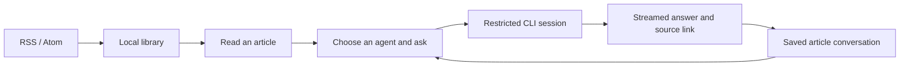

# Design notes

Reedar combines a familiar RSS reading layout with explicit, article-scoped conversations through local coding-agent CLIs. These notes summarize the initial product research and the decisions behind the current preview.

Research date: **September 11, 2026 (JST)**. Current implementation and verification status are documented in the [README](../README.md) and [validation record](validation.md). Research observations and future ideas are not claims of shipped features.

## Start with reading

Reeder 5's Mac interface was inspected directly using its windows, accessibility information, and menus. The observed layout placed folders and subscriptions on the left, an article list in the middle, and the body on the right. Article selection changed unread counts; marking the article unread restored them. Reader View changed the displayed body through text extraction.

Other observed elements included collapsible folders, per-folder unread counts, starred/unread/all filters, article previews, source links, and keyboard-accessible article actions. The subscription dialog and settings were inspected, but a new subscription was not completed in Reeder. Its existing account and settings were left unchanged.

These observations led to a few priorities:

- Preserve article density and predictable navigation.
- Keep the original article visible while discussing it.
- Open the AI panel only when needed.
- Track human reading state independently of AI execution.
- Keep access to the original source alongside generated answers.

Reedar's current preview uses text supplied by the feed. Reeder's full-text Reader View was a research reference, not an implemented Reedar feature.

## Agent launch support is not chat integration

Orca's official materials were reviewed for agent selection, persistent sessions, streaming, execution states, and permission UI. Its desktop integration was not tested directly.

The [supported-agent documentation](https://www.onorca.dev/docs/agents/supported) describes launching CLI processes, with capabilities varying by agent. The [Chat UI documentation](https://www.onorca.dev/docs/agents/native-chat) describes additional integration for presenting sessions as structured conversations. The [session model](https://www.onorca.dev/docs/model/agents-sessions) explains execution and waiting states.

The useful lesson for Reedar is to distinguish finding an executable from proving a reading workflow. Authentication, structured output, cancellation, history, and tool restrictions all need independent verification. An installed CLI must not automatically appear as a working integration.

## The current reading flow

The preview supports direct RSS / Atom registration, folders, unread state, stars, local search, and conversations about one article at a time. Codex and Claude Code have reading adapters; Codex uses GPT-5.3-Codex-Spark. Antigravity is a detected integration target with reading disabled pending tool isolation.

The initial research also considered multi-article comparisons, full-text extraction, translation shortcuts, scheduled digests, and handing an article to an implementation task. Those are ideas, not commitments or implemented features. Inoreader and other subscription-service sync were excluded from the initial scope to avoid requiring an additional service dependency.

## Keep provider-specific behavior at the boundary

The application shares a small model of requests, response text, execution states, and conversation history. CLI discovery, authentication, protocol events, and process shutdown belong in the individual adapters.

A browser page alone cannot launch a user's local CLI. The Electron host and local development server provide that process boundary. Structured CLI interfaces are preferred over scraping terminal text.

Reedar does not assume that sessions can be transferred between providers. Each article-agent pair has its own conversation. The source snapshot is captured when that conversation begins, so later feed updates do not silently replace the evidence behind previous answers.

## Keep reading separate from acting

RSS content is untrusted, and coding agents can otherwise have broad access to files, commands, and external services. The model receives article text and history as quoted data, while the adapter restricts tools and rejects permission escalation. Model instructions alone are not treated as a sufficient restriction.

Reading an article does not require a git worktree, an interactive terminal, or permission to change a project. A future implementation-task handoff would need a separate, explicit workflow with a selected project and scope.

This is also why Antigravity remains pending: the tested connection did not establish per-session restrictions. Changing global permissions or using a different authentication product would alter the intended integration contract.

## Trade-offs

| Decision | Benefit | Cost or limitation |
| --- | --- | --- |
| Direct RSS / Atom fetching | A library without an additional sync subscription | No cross-device or subscription-service sync |
| Local JSON storage | Simple ownership, backup, and inspection | No encryption or multi-user coordination; large-library limits remain unmeasured |
| Existing CLI authentication | Reuses the user's agent access | Depends on CLI versions, available models, and account limits |
| Feed-supplied text | Predictable source and fewer retrieval steps | Excerpt-only feeds produce excerpt-only context |
| Explicit requests per article | Clear consent and controlled usage | No automatic summaries or background digests |
| Restricted reading sessions | Limits what untrusted content can cause | New agents require more than executable detection |

Local CLI access does not imply local inference. The selected article and conversation may be sent to the provider behind that CLI. The interface identifies the chosen provider before submission.

## Research sources

- [Orca](https://www.onorca.dev/)
- [Orca source repository](https://github.com/stablyai/orca)
- [Supported agents](https://www.onorca.dev/docs/agents/supported)
- [Chat UI](https://www.onorca.dev/docs/agents/native-chat)
- [Agents and sessions](https://www.onorca.dev/docs/model/agents-sessions)

External product details reflect the research date. Reeder observations came from direct Mac interaction; Orca observations came from official documentation and browser inspection, not a live agent session in its desktop app.
